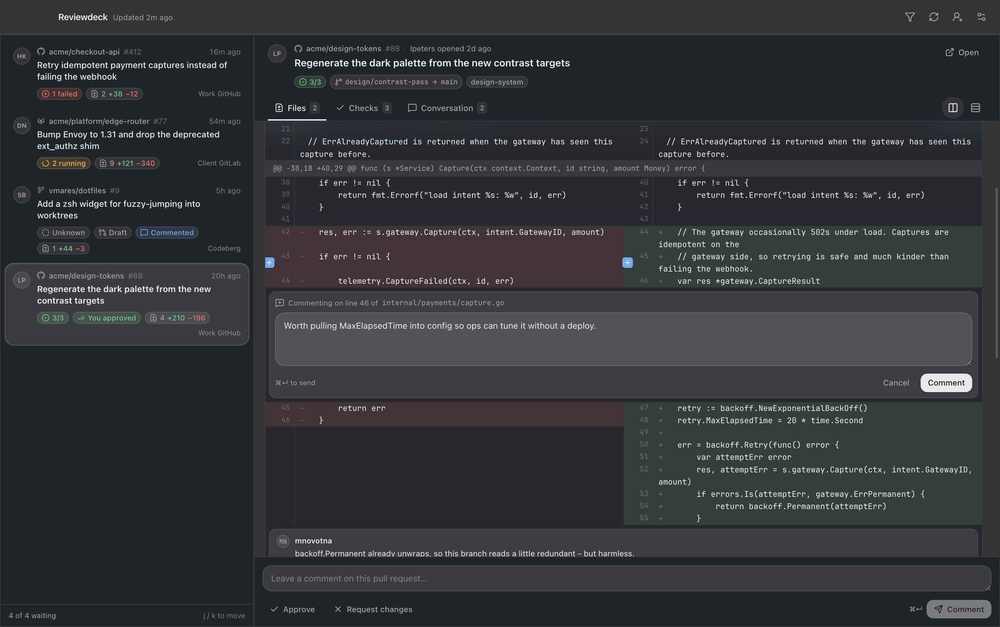

# Reviewdeck

A macOS desktop app that collects every code review waiting on you - across every Git host you
work with - into one deck, and lets you read the diff, comment on lines, and approve without
opening four browser tabs.

Built for the freelance situation: several Git organisations spread over GitHub.com, GitLab.com,
a client's self-hosted GitLab, a Forgejo instance and Bitbucket, with a different account on each.



## What it does

- **Multiple accounts, multiple hosts.** GitHub.com and GitHub Enterprise Server, GitLab.com and
  self-hosted GitLab, Forgejo and Gitea, Bitbucket Cloud. Add as many accounts as you like,
  including several on the same host.
- **One aggregated deck.** Everything where your review has been requested, newest activity first,
  filterable by account, check status or free text.
- **Native notifications** when a new review request appears, with a menu-bar count of what is
  still waiting.
- **A real diff viewer** - side by side or unified, with inline comments on any line and existing
  review comments anchored where they were left.
- **Approve or request changes** from the app, plus ordinary pull-request comments.
- **CI status at a glance.** Passed / Running / Failed / Unknown per pull request, with the
  per-check breakdown, and a faster background poll while anything is still running.

## Running it

```sh
pnpm install
pnpm dev            # development, with hot reload
pnpm build          # typecheck + production bundle
pnpm dist           # signed-if-possible .dmg in release/
pnpm dist:dir       # unpacked .app in release/mac-arm64/
pnpm test           # unit tests for the diff parser and provider helpers
pnpm icon           # regenerate resources/icon.icns
```

The pnpm version is pinned in `package.json` under `packageManager`, so `corepack enable` is
enough to get the right one.

To poke at the UI without connecting a real account, run with `REVIEWDECK_DEMO=1` - the deck fills
with fixtures and the diff viewer renders a sample pull request.

## Signing in

Reviewdeck authenticates with **personal access tokens**, not OAuth. OAuth would need an
application registered up front on every instance, which is impossible for the self-hosted GitLab
or company Forgejo you were handed a login to last week. A token works everywhere, immediately.

Tokens are encrypted with Electron's `safeStorage`, which is backed by the macOS Keychain, and are
written to `~/Library/Application Support/reviewdeck/reviewdeck.json`. They never cross into the
renderer process - the UI only ever asks the main process to make a call on its behalf.

| Provider | Where to create one | Scopes needed |
| --- | --- | --- |
| GitHub / GHES | Settings → Developer settings → Personal access tokens | `repo`, `read:org` |
| GitLab | Settings → Access tokens | `api` |
| Forgejo / Gitea | Settings → Applications | `read:user`, `read:repository`, `write:issue`, `write:repository` |
| Bitbucket Cloud | Personal settings → App passwords | Account: Read, Pull requests: Write |

Bitbucket app passwords authenticate as a username/password pair, so it asks for your username too.

## How it fits together

```
src/
├── main/                 Node side: no UI, owns all network and all secrets
│   ├── index.ts          window, tray, menu, lifecycle
│   ├── deck.ts           the sync engine: fan-out, notifications, check polling
│   ├── store.ts          accounts + settings on disk, tokens via safeStorage
│   ├── http.ts           fetch wrapper: timeouts, pagination, readable errors
│   ├── ipc.ts            every channel the renderer may call
│   └── providers/        one adapter per host, behind a single interface
├── preload/index.ts      the contextBridge surface - the only way in
├── shared/               types and the diff parser, used by both sides
└── renderer/src/         React UI
```

The renderer never talks to a Git host. It asks the main process, which holds the tokens and does
the HTTP. Context isolation is on, node integration is off, and the renderer runs under a CSP with
`connect-src 'self'`, so a malicious pull request title has nowhere to go.

### Adding a provider

Implement the `Provider` interface in `src/main/providers/types.ts` - connect, list review
requests, load a diff, refresh checks, submit a review, comment, comment on a line - and register
it in `src/main/providers/index.ts`. Everything above that layer is provider-agnostic.

### Notes on the provider APIs

Each host makes a different part of this hard:

- **GitHub** aggregates cheaply (`search/issues?q=review-requested:@me`) but needs a follow-up call
  per pull request for the diff stats, and check runs and legacy commit statuses are two separate
  endpoints that both have to be merged.
- **GitLab** is the friendliest: `scope=reviews_for_me` does the aggregation server-side. In
  exchange, line comments need the base/start/head SHAs from the MR versions endpoint, and there is
  no single "submit review" call - approving and commenting are separate requests.
- **Forgejo / Gitea** has `review_requested=true` on its issue search, and attaches inline comments
  to a review rather than to the pull request.
- **Bitbucket** has no "awaiting my review" endpoint at all - `/pullrequests/{user}` returns what
  you *authored*. So it walks your workspaces, lists each repository's open pull requests and keeps
  the ones naming you as a reviewer, bounded to 120 repositories so a large account cannot stall a
  sync.

## Design

Milky glass: macOS vibrancy supplies the blur, and the renderer paints a heavy translucent film on
top so text stays crisp over any wallpaper. Neutral graphite palette, generous rounded corners,
colour reserved for status. The window is deliberately *not* `transparent: true` - that disables
vibrancy and reads as see-through rather than frosted.

## Limitations

This is an MVP.

- macOS only.
- Bitbucket Server (the self-hosted one) uses a different API and is not supported; Bitbucket Cloud is.
- Comment bodies render as plain text, not Markdown.
- Diffs are not syntax highlighted.
- Line comments start a new thread; replying to an existing thread happens in the browser.

## Licence

MIT
